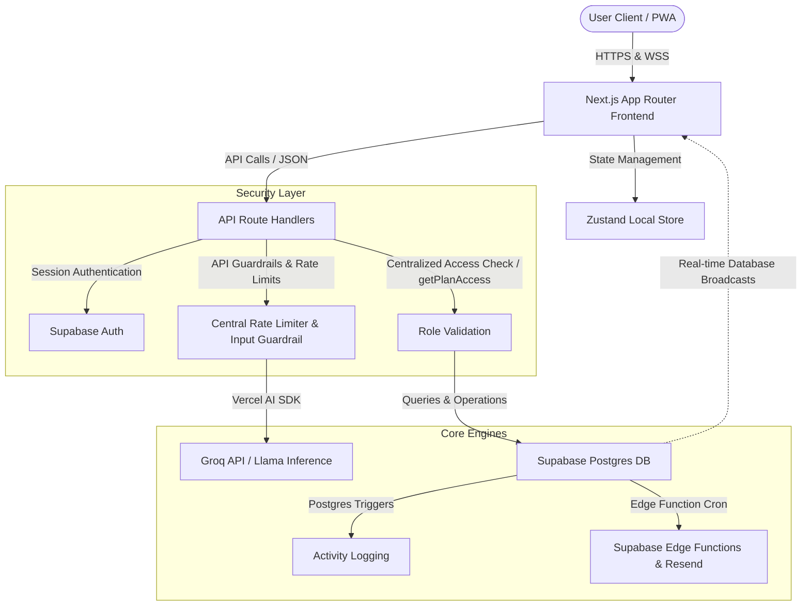

# <p align="center"> Planora</p>

<p align="center">
  <strong>Plans that actually happen — together.</strong><br />
  The collaborative trip planner that converts "we should hang out" into "here's the boarding pass."
</p>

<p align="center">
  
  
  
  
  
</p>

---

Planora is an enterprise-grade collaborative travel planning application designed to streamline group trip coordination. By merging real-time synchronization, interactive AI generation, democratic voting consensus engines, and smart chronological sorting, Planora eliminates coordination friction and solves group travel planning challenges.

---

## 🛠️ System Architecture

Planora uses a highly decoupled, real-time client-server architecture built on Next.js 15, Supabase, and the Groq Inference Engine.



---

## ✨ Features

### 🧠 Advanced AI Itinerary Generation
*   **Chronological Traveler Arc**: Generates structural day plans containing matching Morning (active sight), Lunch (local culinary), Afternoon (district-aligned secondary activity), Evening (leisure stroll), and Night (dinner & rest) blocks.
*   **Neighborhood Spatial Cohorts**: Groups daily activities within localized neighborhoods to prevent zig-zag travel.
*   **Trip Pacing & Volume Tuning**: Limits activity count dynamically to match traveler pacing profiles (`slow`: 1-2, `moderate`: 2-3, `fast`: 3-4 activities per day).
*   **Arrival/Departure Safeguards**: Tailors lighter half-day schedules for Day 1 and the final day to respect airport/terminal travel constraints.

### 💬 Collaborative Chat Agent (PlaBot)
*   **Interactive Context Integration**: Allows group members to chat with PlaBot directly inside their trip plan to modify the itinerary.
*   **Bulk Transaction Processing**: Executes multi-item edits, inserts, and deletions in a single tool call to optimize token performance and speed.
*   **Democratic Interception**: Automatically places modifications suggested by regular group members into a "Pending Suggestions" state for voting, while allowing Trip Admins to apply edits directly.

### 🗳️ Democratic Decision Engine
*   **Consensus-Driven Promotion**: Automatically promotes group suggestions to the official itinerary when all members vote and the upvotes exceed downvotes, cleaning up alternatives in real time.
*   **AI scout Tie-Breaker**: Automatically calls the Llama Scout tie-breaker tool when consensus results in a tie, suggesting an alternative item matching the budget and category.
*   **Real-time synchronization**: Propagates voting cards and consensus actions instantly to all active browsers using Supabase Realtime subscriptions.

### 📊 Expense Splitter & Receipt OCR Engine
*   **High-Fidelity OCR Scanning**: Integrates Groq Vision to extract total, merchant, date, currency, and line items from receipts.
*   **Collaborative Ledger**: Supports multiple currencies and calculates optimal repayment balances instantly, resolving who owes what.

---

## 🚀 Getting Started

### Prerequisites
- **Node.js** &ge; 18.0.0
- **pnpm** &ge; 9.0.0 (Recommended)
- A **Supabase** project instance
- A **Groq Cloud** API key
- A **Resend** mail delivery account
- A **LocationIQ** geocoding token

### 1. Clone & Install Dependencies
```bash
git clone https://github.com/apoorvmaurya/planora.git
cd planora
pnpm install
```

### 2. Configure Environment Variables
Copy either the generic or local environment template and fill in your keys:
```bash
cp .env.example .env.local
```
Key requirements:
```properties
# Supabase Database Settings
NEXT_PUBLIC_SUPABASE_URL=https://your-project.supabase.co
NEXT_PUBLIC_SUPABASE_ANON_KEY=your-supabase-anon-key
SUPABASE_SERVICE_ROLE_KEY=your-supabase-service-role-key

# LLM Inference (Groq)
GROQ_API_KEY=gsk_your-groq-api-key

# Geocoding & Mapping (LocationIQ)
LOCATIONIQ_KEY=pk.your-locationiq-key

# Email Dispatcher (Resend)
RESEND_API_KEY=re_your-resend-key

# App Settings
NEXT_PUBLIC_APP_URL=http://localhost:3000

# Web Push Notifications (VAPID)
NEXT_PUBLIC_VAPID_PUBLIC_KEY=your-vapid-public-key
VAPID_PRIVATE_KEY=your-vapid-private-key
```

### 3. Apply Schema Migrations
Planora database schemas, trigger rules, Row Level Security (RLS) configurations, and Edge Functions are managed in the `supabase/` folder:
```bash
# Apply migrations to your remote database via Supabase CLI
supabase db push
```

### 4. Launch Development Environment
```bash
pnpm dev
```
Open [http://localhost:3000](http://localhost:3000) to view the application.

---

## 🧪 Testing & Isolated Verification

Planora includes an enterprise-grade automated test suite built on **Vitest** and **@testing-library**, complete with an in-memory Supabase mock client so you can test features without live external accounts.

### Run Automated Tests & Coverage
```bash
# Run all unit tests with full V8 coverage report
pnpm test

# Run tests in watch mode during development
pnpm exec vitest
```

### Offline & Mock Testing Architecture
- **In-Memory Supabase Mock Client** (`lib/testing/supabaseMock.ts`): Provides simulated CRUD operations, query filter chains (`.eq()`, `.in()`, `.order()`, `.single()`), and auth sessions.
- **Network Isolation**: `vitest.setup.ts` automatically intercepts database clients, ensuring route handlers and component tests never invoke live network requests or consume API quotas.
- **Coverage**: Verified unit test coverage across chronological itinerary sorting, security access authorization, and multi-party expense calculations.

---

## 🐳 Docker & Local Stack

To run Planora and a local PostgreSQL database in isolated containers:

```bash
# Build and launch application and local database
docker compose up -d

# View container logs
docker compose logs -f app
```

A VS Code Dev Container configuration is also included at `.devcontainer/devcontainer.json` for standardized environments across teams.


---

## 📂 Codebase Layout & Modular Architecture

Planora strictly adheres to a modular design principle with **0 files exceeding 500 lines of code** across the entire repository. Heavy client views and AI tool orchestration are decomposed into focused, single-responsibility components:

```
planora/
├── app/
│   ├── (app)/              # Authenticated dashboard, plans, groups, and settings
│   │   ├── plans/[planId]/ # Modularized trip view (<450 LOC) with extracted tab/drawer components
│   │   ├── plans/new/      # 4-step wizard decomposed into dedicated step components
│   │   └── groups/         # Group collaborative space and tabbed settings panels
│   ├── (auth)/             # Authentication flow (sign up, sign in, onboarding)
│   ├── (public)/           # High-conversion landing page and guides
│   ├── api/                # Strictly validated API routes with Zod schema checks
│   └── globals.css         # Modern CSS system, HSL color tokens, and animations
├── components/
│   ├── layout/             # Navigation controls and responsive sidebar
│   ├── providers/          # Authentication and theme context providers
│   ├── shared/             # Specialized modular UI components:
│   │   ├── PlanChatDrawer.tsx          # Real-time AI chat slide-over (<250 LOC)
│   │   ├── PlanItineraryTab.tsx        # Chronological day slot & map orchestration (<210 LOC)
│   │   ├── PlanSidebar.tsx             # Trip metadata, group avatars, and actions (<190 LOC)
│   │   ├── PlanActivityLogDrawer.tsx   # Audit history with diff view & 1-click revert (<200 LOC)
│   │   ├── EditPlanComparisonPanel.tsx # Side-by-side AI draft comparison & merge (<320 LOC)
│   │   ├── EditPlanConfigForm.tsx      # Trip configuration and regeneration controls (<170 LOC)
│   │   └── TransitPanel.tsx            # Multi-modal transit route suggestions & sync (<220 LOC)
│   └── ui/                 # Atomic design primitives (shadcn/ui accessible components)
├── hooks/                  # Specialized reactive hooks (usePlanDetails, useGroup, useFriends)
├── lib/
│   ├── ai/                 # Centralized AI model configs (AI_MODELS), prompt schemas, and tools:
│   │   ├── planChatTools.ts            # PlaBot tool definitions & execution (<330 LOC)
│   │   └── bulkUpdateTool.ts           # Atomic batch itinerary upsert/delete operations (<290 LOC)
│   ├── itinerary/          # Logical sorting, time-of-day weighting, and database reordering utilities
│   ├── locationiq/         # Geocoding helpers and request rate-limiting queues
│   ├── security/           # Centralized authorization (getPlanAccess), rate-limiting, and guardrails
│   ├── types/              # Strongly typed domain interfaces (PlanItem, MemberVote, GroupMember)
│   ├── validations/        # Zod validation schemas for all API route requests
│   └── errors.ts           # Standardized application error hierarchy (AppError, ValidationError)
├── store/                  # Zustand state trees for local/offline reactivity
├── supabase/               # Database migration scripts and edge functions
└── public/                 # Static assets, Web manifest files, and PWA configurations
```

---

## 🛡️ Security & Guardrails
Planora is built with a defense-in-depth approach to security:
1.  **Insecure Direct Object Reference (IDOR) Mitigation**: All write and read routes validate client requests against the centralized `getPlanAccess` guard.
2.  **Input Guardrails**: Protects against jailbreak attempts and off-topic requests using a fast classification pass before LLM dispatch.
3.  **Strict Zod Request Validation**: API endpoints (`vote`, `transit/add`, `items`) enforce strict schema validation to reject malformed input before execution.
4.  **Stateless Rate Limiting**: Centralized API request logs prevent system abuse and protect infrastructure from high token utilization.
5.  **Supabase Row Level Security (RLS)**: Secures all tables with tenant-level RLS policies to prevent direct database leaks.

---

## 📄 License
This project is licensed under the MIT License - see the [LICENSE](LICENSE) file for details.
